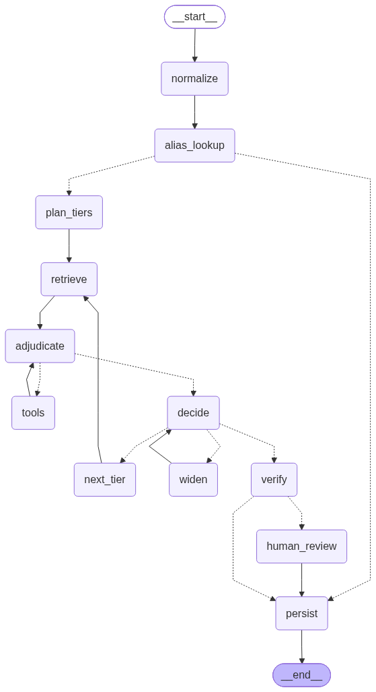

# ontology_mapper

Map a free-text biomedical entity onto a **stable ontology identifier**, with every
decision logged and every adjudicated match reused.

```
$ python -m src.cli --term "CSF" --class specimen
term       : CSF
outcome    : match  (flag=exact)
identifier : UBERON:0001359
label      : cerebrospinal fluid
ontology   : uberon
```

The agent is a LangGraph workflow over EBI's [Ontology Lookup
Service](https://www.ebi.ac.uk/ols4/). It retrieves candidates, lets a model traverse
the ontology graph to judge them, takes an independent second opinion, pauses for a
human on anything consequential, and writes the result to two TSV tables. The alias
table means the second time you ask about a term, no model is called at all.

Every run ends in exactly one of three outcomes:

| outcome | meaning | flags |
|---|---|---|
| **match** | the ontology has this concept | `exact`, `semantic` |
| **close** | only a broader or narrower entry exists | `parent`, `child` |
| **no match** | nothing in any tier denotes it | `none` |

## Setup

```bash
pip install langchain-openai        # langgraph, langchain-core, requests assumed present
echo 'OPENAI_API_KEY=sk-...' > .env # or export it; .env is gitignored
```

The model is `gpt-6-luna`, set in [src/llm.py](src/llm.py). It is pinned to the
Responses API — see [Model constraints](#model-constraints).

## Usage

```bash
python -m src.cli --term "IgG4-related disease" --class disease
python -m src.cli --term "MUC2 (human)" --class protein --context "mucin, gastrointestinal"
python -m src.cli --term "HeLa cell line" --class specimen --approve cyrus
```

`--class` is one of `protein`, `disease`, `specimen`, `organism`.
`--context` is optional free text used only to disambiguate.

### Human approval

Anything consequential pauses rather than deciding for you. A run interrupts when the
model claims `exact` (which would write a permanent alias), when the reviewer
disagrees, or when confidence is below `0.7`:

```
--- HUMAN APPROVAL NEEDED ---
{ "term": "immunoglobulin complex",
  "proposed": {"curie": "PR:000050032", "relation": "child", "confidence": 0.92},
  "verification": {"confirmed": false, "relation": "exact", ...} }

resume with: --thread <id> --approve <name>
```

The checkpointer holds the run, so you can resume later with the same `--thread`.
`--approve NAME` auto-approves every checkpoint — convenient for development, but it
defeats the point in production.

## The tables

Both live in `data/tables/` as TSV and are meant to be committed — they are the
accumulated knowledge of the project. `*.bak` and `*.tmp` are gitignored.

**`decisions.tsv`** — append-only provenance, one row per run:

| term | standardized_term | term_id | ontology | flag | annotation | decided_by | time |
|---|---|---|---|---|---|---|---|
| T lymphocyte | T cell | CL:0000084 | cl | exact | approved after gpt-6-luna proposed exact | HumanReviewer:CCHAY | 2026-10-01T21:46:05+00:00 |

`annotation` carries anything that qualifies the result — reviewer objections,
retrieval failures, your own notes. `decided_by` is `alias`, the model name, or
`human:<name>`.

**`aliases.tsv`** — the memory. Keyed on `(lowercased term, ontology_class)`, written
only for `exact` and `semantic` matches. `parent`/`child`/`none` never become aliases.

An alias hit short-circuits the entire graph: no retrieval, no model call, no cost.
Note this also means **the first adjudicated answer is frozen** — the preference order
no longer applies to that term. Delete the row to force a re-resolution.

## Ontology preference order

Tiers are deterministic graph data, not something the model chooses. A query escalates
only when the current tier yields nothing. Defined in [src/tiers.py](src/tiers.py):

| class | order | notes |
|---|---|---|
| protein | `pr → go → ncit` | PR embeds 155,814 UniProt accessions as `PR:P08069`-style ids, so it covers the UniProt tier |
| disease | `doid → mondo → efo → ncit` | MONDO catches what DOID lacks; EFO carries trait/GWAS phrasing |
| specimen | `uberon → cl → bto → ncit` | anatomy, then cell types, then tissue/cell-line phrasing |
| organism | `ncbitaxon` | alone, and lexical only |

## Workflow



Source: [docs/workflow.mmd](docs/workflow.mmd). Regenerate with
`python -c "from src.graph import build; print(build().get_graph().draw_mermaid())"`.

| node | does |
|---|---|
| `normalize` | collapse whitespace so the alias key is stable |
| `alias_lookup` | exact hit → straight to `persist`, no model call |
| `plan_tiers` | resolve the class to its ontology order |
| `retrieve` | hybrid: lexical always, embedding where useful; merged by CURIE |
| `adjudicate` | model with `bind_tools`; may call lookups |
| `tools` | prebuilt `ToolNode` — `list_parents`, `list_children`, `get_entity`, `next_page` |
| `decide` | `with_structured_output` collapses the conversation into one verdict |
| `widen` | on a `child` verdict, traverse up once and reconsider |
| `next_tier` | escalate, clearing candidates and message history |
| `verify` | independent reviewer that never sees the first reasoning |
| `human_review` | `interrupt()` — resumable, not a blocking prompt |
| `persist` | log the decision; promote `exact`/`semantic` to an alias |

### Why LangGraph rather than a general agent

The properties worth having here are structural, not prompt-level:

- **The tier order is an edge**, so the model cannot decide to try MONDO first.
- **Tools are scoped to `adjudicate`** and capped by `TOOL_BUDGET`, enforced in the
  graph rather than requested in the prompt.
- **`verify` is a separate node** with a fresh prompt that never sees the adjudicator's
  reasoning — a single agent loop cannot structurally guarantee that.
- **`interrupt()` + checkpointer** make approval resumable days later.
- **`RetryPolicy` sits only on network nodes**, so a transport blip never silently
  re-bills an LLM call.

### Tool-discovered entries are selectable

Traversal results are written into a `discovered` channel and become valid answers,
carrying **their own** ontology. This matters: PR has no species-agnostic
`immunoglobulin complex` — every PR entry is `(human)`-qualified — but
`PR:000050032`'s parent is `GO:0019814 immunoglobulin complex`, an exact match. The
agent reaches it by traversal while searching `pr`, and logs `ontology=go`.

Chosen identifiers are validated against what was actually retrieved or traversed; an
identifier the model never saw is rejected and logged as `none` with
`rejected unseen identifier X`.

## OLS API notes

Hard-won, all verified against the live service. [src/ols.py](src/ols.py) absorbs them.

1. **The embedding API is undocumented but real**: `GET /api/v2/entities/llm_search`.
   Only `llama-embed-nemotron-8b_pca512` can embed live query text
   (`GET /api/v2/llm_models` lists the rest, which expose precomputed vectors only).
2. **PR has no embeddings** — the request hangs rather than returning empty.
   **NCBITaxon returns 0 results.** Both are in `NO_EMBEDDINGS` and skipped.
3. **Embedding search misses exact lexical hits.** `NCIT:C568` (label exactly `IgG`) is
   absent from the embedding top 50 but rank 1 lexically. Hence hybrid retrieval.
4. **`ontology=pr` includes imported classes** — always pass `isDefiningOntology=true`
   (`local=true` is broken and returns 0), and check the `short_form` prefix.
5. **`obo_id` is empty for PR terms.** CURIEs come from `short_form` (`PR_000050339` →
   `PR:000050339`).
6. **`exact=true` is token-level**, not whole-label: `q=IgG&exact=true` returns
   "IgG immunoglobulin complex". Exactness is re-checked client-side.
7. **Text fields have three shapes** — string, list, or reification objects
   (`{"type": ["reification"], "value": ...}`). `_text()` flattens all three.
8. **Traversal needs double-URL-encoded IRIs**:
   `quote(quote(iri, safe=""), safe="")`.
9. **The service is genuinely flaky.** Measured: a 500 after 63s, then 200 in 1.4s on
   retry. Lexical gets 45s × 4 attempts; the best-effort embedding call gets **12s and
   no retry**, because giving it equal patience turned an outage into a 6-minute stall
   per call. Failures land in the decision `annotation` rather than being swallowed.

### Model constraints

`gpt-6-luna` rejects `temperature`, and refuses function tools on
`/v1/chat/completions` unless `reasoning_effort='none'`. It is therefore pinned to
`use_responses_api=True`, which keeps reasoning: on an identical prompt that produced
**4 parallel lookups** versus 1 with reasoning disabled.

There is no temperature control, so adjudication is **not reproducible** — the same
term can resolve differently across runs. The alias table freezes whichever answer came
first, which is a reason to review first-time matches rather than `--approve` them.

## Tests

```bash
python tests/test_wiring.py
```

14 tests, no API key or network needed — the model and OLS are stubbed. They assert the
structural guarantees: tier escalation, the tool budget, parallel tool-call
accumulation, resumable interrupts, alias promotion rules, rejection of unseen
identifiers, bounded widening, and that the two prompts share one relation glossary.

## The offline path (`script/`)

Predates the OLS work and still functions, for querying downloaded `.obo` files
directly. Streaming parsers, no dependencies beyond `requests`/`tqdm`:

```bash
python script/download.py --all                        # fetch ontologies
python script/fast_query.py "angiosarcoma" doid.obo --exact
python script/map_terms.py doid.obo "angiosarcoma" "pterygium"
```

`map_terms.py` renders matches spliced into a sub-taxonomy with one layer of parents —
useful for eyeballing structure. It streams rather than indexing: 0.93s and 13 MB
against the 206 MB `pr.obo`.

## Known limitations

- **`close` is terminal.** A `parent`/`child` verdict ends the tier walk, so an exact
  match in a lower-preference ontology can be missed. `widen` mitigates the `child`
  case by traversing up once; the general fix (escalate on `parent`/`child`, keeping
  the best close match) is not implemented.
- **The tool budget is a between-turns check**, not a hard ceiling: `ToolNode` runs
  every call in a turn, so a turn with 4 parallel calls can carry the total past 6.
- **Embedding quality varies by ontology.** UBERON returns nearest neighbours with no
  relevance floor, and ontology-filtered results carry no usable score.
- **No batch input, no response caching, no cross-ontology (OxO) mapping.**
